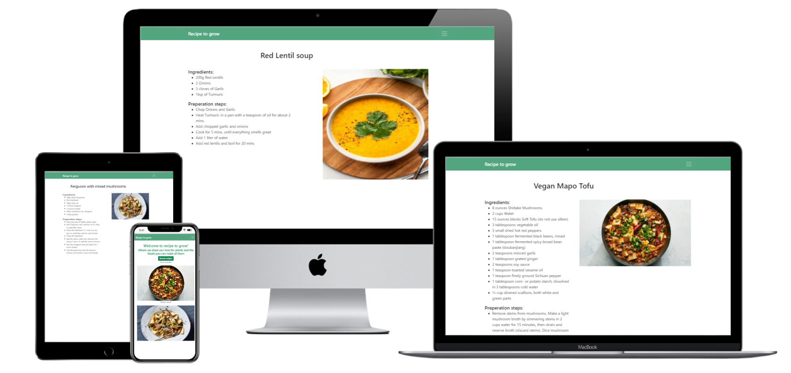

---

Recipe to grow is a website where users can share their favorite plant based recipes. Additionally, users can find links to products in my webshop (external site) for plants, that are appropriate to the recipe. 

**-- [See live site on Heroku](http://recipe-to-grow.herokuapp.com/) --**

---

## Table of contents

**

User Experience
**
  - [User stories](#user-stories)
  - [Strategy](#strategy)
  - [Scope](#scope)
  - [Structure](#structure)
  - [Skeleton](#skeleton)
  - [Surface](#surface)

**

Features
**
  - [Existing features](#existing-features)
  - [Future features](#future-features)

**

Technologies Used
**
  - [Languages](#languages)
  - [Libraries, Frameworks and programs](#Libraries,-Frameworks-and-programs)

**

Testing
**
  - [Test documentation](#)

**

Deployment
**
  - [Deployment to GitHub pages](#deployment-to-github-pages)
  - [Forking this repository](#forking-this-repository)
  - [Local deployment](#local-deployment)

**

Credits
**
  - [Text](#text)
  - [Media](#media)
  - [Acknowledgements](#acknowledgements)

---

## &rarr; **User Experience**

### **<ins>User stories</ins>**
As a non-contributing visitor to the site I want to:
  - view all available recipes
  - view the most popular recipes
  - view the most recently added recipes

As a contributing visitor to the site I want to:
  - add a recipe to the site
  - edit my own recipes
  - delete my recipes

### **<ins>Strategy</ins>**
The main purpose of the site is the sharing of plant-based recipes. The functionality to do so will be featured front and center to make it as easy as possible. Additionally the site will serve as a window, where plants the site owner sells on another website can be displayed. 

### **<ins>Scope</ins>**
The site will be feature adding, viewing, updating and deleting of own recipes. Additionally users will be able to register and login. Plants for sale will be featured alongside the recipes.

### **<ins>Structure</ins>**
 The main page will feature a button to immediatly take the visitor to all recipes. The menu will change depending on the logged-in status. The menu will be a hamburger meu on all sizes, and feature a drop down menu. The 'add recipe' and the 'edit recipe' pages are only accesible from the 'my recipes' page, all other pages are navigatable through the hamburger menu.

### **<ins>Skeleton</ins>**
The following wireframes were made using Balsamiq to give a rough idea of the project.
- [Home page](wireframes/home.png)
- [All recipes](wireframes/all_recipes.png)
- [Single recipe](wireframes/single_recipe.png)
- [Login](wireframes/login.png)
- [Register](wireframes/register.png)
- [Add recipe](wireframes/add_new_recipe.png)

### **<ins>Surface</ins>**
The page is designed around basic colours, mainly in the green spectrum. This is to emphasize the plant based nature of the site. 

---

## &rarr; **Features**

#### **<ins>Existing features</ins>**
|#|Name|Description|
|-|-|-|
|1|Add recipe|Users can add recipes when logged in|
|2|Edit recipe|Users can edit their own recipes when logged in|
|3|Delete recipe|Users can delete their own recipes when logged in|
|4|View recipe|View an individual recipe|
|5|Search|Search through all recipes on the site|
|6|Search - Reset|Reset the search, to view all recipes again|
|7|Register|Register for an account to contribute to the site|
|8|Login\logout|Allows recipes to be assigned and managed by users|
|9|Linked Products|Seeds and plants appropriate to the recipe are shown underneath the recipe|

#### **<ins>Future features</ins>**
|#|Name|Description|
|-|-|-|
|1|Social links|Allows sharing of a recipe on social media platforms|
|2|More profile content|More profile content features like an avatar and the option to change password.|
|3|Favorites|Mark a recipe as a favorite to save it to your profile|
|4|Categories|Recipes are put into categories for easier searching|

---

## &rarr; **Technologies Used**
### **<ins>Languages</ins>**

| 
HTML5
 | 
CSS3
 | 
Javascript
 | 
Python
 |
|-|-|-|-|
|  |  |  |  |

### **<ins>Libraries, Frameworks and programs</ins>**
- [JQuery 3.5.1](https://jquery.com/)
  * Used for easier DOM access.
- [Bootstrap 5.1.0](https://getbootstrap.com/docs/5.1/getting-started/introduction/)
  * Used widely troughout the site to speed up layout design.
- [Multi device mockup generator](http://techsini.com/multi-mockup/index.php)
  * Used to create the header image of this readme file.
- [Favicon generator](https://favicon.io/favicon-generator/)
  * Used to create a custom favicon.
- [Font Awesome](https://fontawesome.com/)
  * Used for the add\remove and edit\delete icons

---

## &rarr; **Deployment** 
### **<ins>Deployment to Heroku</ins>**
1. Created the project on Github. Git and Github were also used for the version control.
2. Created a new, empty app on Heroku
3. Linked the Github repository to the app
4. Created the Config Vars on the settings page of the app. In order to make the application work for yourself, ensure you create the following keys here:
   - SECRET_KEY (needed for Flash messages)
   - MONGO_DBNAME (your MongoDB database name)
   - MONGO_URI (the URI to your database)
5. From the deploy page, ran a manual deploy, after which, automatic deployment was enabled for the 'main' branch

### **<ins>Forking this repository</ins>**
1. Login to [GitHub](https://github.com)
2. Browse to the [repository](https://github.com/ElkeJohannes/Recipe-to-grow)
3. On the top right of the page, there should be a button that says 'Fork'. Click on this button to fork a copy of the site to your own repositories.

---

## &rarr; **Credits**

### **<ins>Text</ins>**
- Vegan mapo tofu recipe taken from: [NY Times](https://cooking.nytimes.com/recipes/1017358-vegan-mapo-tofu) 

### **<ins>Media</ins>**
- All images taken from the sites where the recipes came from

### **<ins>Acknowledgements</ins>** 
- Info taken from: [Flask documentation website](https://flask.palletsprojects.com/en/2.0.x/patterns/fileuploads/) on how to do file uploads.
- [This stack overflow question](https://stackoverflow.com/questions/47083403/extracting-input-from-all-input-boxes-into-a-list-using-flask) on how to handle multiple input boxes into an array.