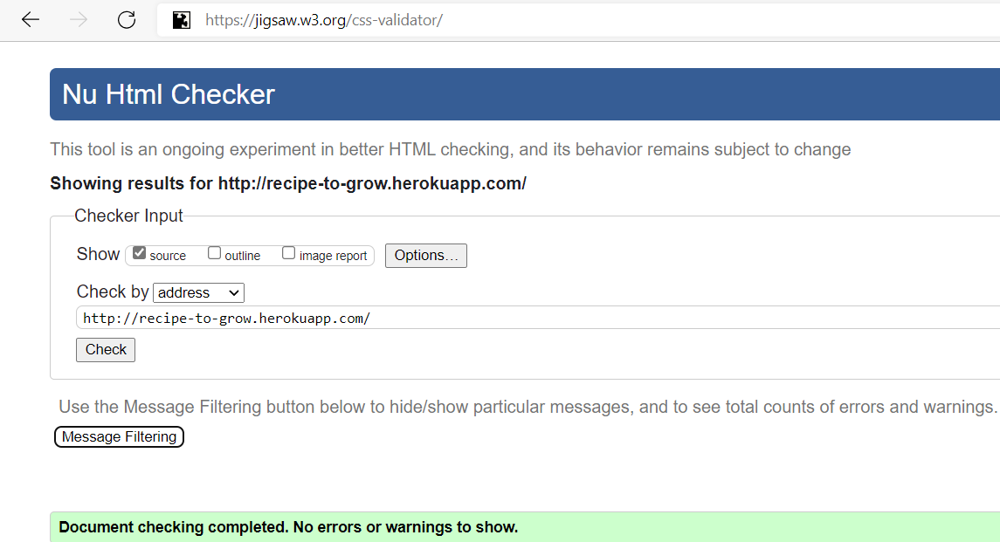
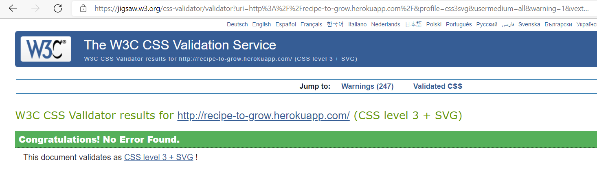
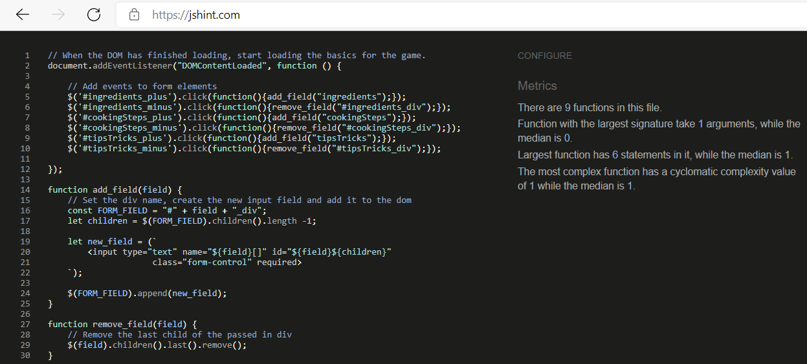
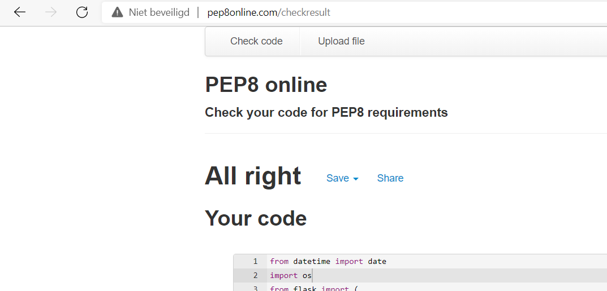

## <ins>**Testing**</ins>

---

**

Table of contents
**
  - [Code validation](#code-validation)
  - [User story tests](#user-story-tests)
  - [Manual testing script](#manual-testing-script)
  - [Feature test scripts](#feature-test-scripts)
  - [Bugs](#bugs)

---

## &rarr; **Code validation**
- Tested for valid HTML code using [w3 validator](https://validator.w3.org/nu/) 

- Tested for valid CSS code using [Jigsaw validator](https://jigsaw.w3.org/css-validator/) 
 

- Tested for valid Javascript using [Jshint](https://jshint.com/) 

- Tested for PEP8 compliance using [pep8online](http://pep8online.com/) 

---

## &rarr; **User story tests**
As a non-contributing visitor to the site I want to:
  - view all available recipes
    * When on the home page, you can click on the 'Browse recipes' button. This page is also accesible from the navigation menu.
  - view the most popular recipes
    * When on the home page, there is a carousel displaying the most popular recipes
  - view the most recently added recipes
    * When on the home page, there is a carousel displaying the most recently added recipes

As a contributing visitor to the site I want to:
  - add a recipe to the site
    * After logging in, there is an additional option available on the menu to add a recipe. The 'Add recipe' page is also accesible from the 'My recipes' page.
  - edit my own recipes
    * After logging in, you can edit your own recipes from the 'My recipes' page. To do so, you can click the edit icon behind the recipe name.
  - delete my recipes
    * After logging in, you can delete your own recipes from the 'My recipes' page. To do so, you can click the delete icon behind the recipe name.

---

## &rarr; **Manual testing script**
In all below testing actions, it is assumed you have opened the website on **any** device. 

|Test name|Actions|
|-|-|
|<ins>Browse recipes button</ins>|- Click on the 'Browse recipes' button  - Confirm you are taken to the 'All recipes' page|
|<ins>Most popular - carousel auto play</ins>|- Ensure you are on the home page, with the 'Most popular' carousel in sight - Confirm the carousel changes recipes automatically, showing a selection of recipes|
<ins>Most popular - carousel navigation buttons</ins>|- Ensure you are on the home page, with the 'Most popular' carousel in sight - Confirm the carousel changes recipes whenever you click on one of the arrows on the left hand or right hand of the image|
|<ins>Newly added - carousel auto play</ins>|- Ensure you are on the home page, with the 'Newly added' carousel in sight - Confirm the carousel changes recipes automatically, showing a selection of recipes|
<ins>Newly added - carousel navigation buttons</ins>|- Ensure you are on the home page, with the 'Newly added' carousel in sight - Confirm the carousel changes recipes whenever you click on one of the arrows on the left hand or right hand of the image|
|<ins>Recipe to grow - navbar link</ins>|- Click on the header 'Recipe to grow' on the top left of the page in the navigation bar - Confirm you are taken to the home page|
|<ins>Hamburger menu</ins>|- Click on the hamburger menu on the top right of the page - Confirm the menu expands below the hamburger icon|
|<ins>Menu Link - All recipes</ins>|- Click on the hamburger menu  - Click on the 'All recipes' link - Confirm the 'All recipes' page opens|
|<ins>Menu Link - Login \ register</ins>|- Click on the hamburger menu  - Click on the 'Login \ register' link - Confirm the 'Login \ register' page opens|
|<ins>Menu Link - My recipes</ins>|- While logged in, click on the 'My recipes' link from the hamburger menu  - Confirm you are taken to the 'My recipes' page|
|<ins>Menu Link - Add recipe</ins>|- While logged in, click on the 'Add recipe' link from the hamburger menu  - Confirm you are taken to the 'Add recipe' page|
|<ins>Menu Link - Logout</ins>|- While logged in, click on the 'Logout' link from the hamburger menu  - Confirm you are taken to the 'Home' page and a message is displayed, saying you are logged out|

---

## &rarr; **Feature test scripts**
For testing, 2 device types are defined:
- Mobile
    * Any device with a horizontal screen width **smaller** then 567px. This can also be achieved using browser developer tools.
- Mobile+
    * Any device with a horizontal screen width **larger** then 567px

|1|Add recipe|
|-|-|
- Fill in the required fields and then click the green 'Add recipe' button below the form
- Confirm you are taken to the 'My recipe' page, and the just created recipe is now showing in the list

|2|Edit recipe|
|-|-|
- While logged in, browse to the 'My recipes' page
- Click on the edit button (pencil icon) next to a recipe
- Confirm you are taken to the 'Edit recipe' page with the selected recipe showing
- Make changes to one or more fields and click the green 'Save' button
- Confirm you are brought back to the 'My recipes' page with a message saying 'Edit succesful'
- Click on the just edited recipe
- Confirm the recipe shows correctly, with the changes made visible

|3|Delete recipe|
|-|-|
- While logged in, browse to the 'My recipes' page
- Click on the delete button (trash icon) next to a recipe
- Confirm a message saying 'Recipe deleted' shows, and the recipe dissapears from the list

|4|View recipe|
|-|-|
- Click on any of the recipes on either the 'Most popular' or 'Newly added' carousels
- Confirm the 'View recipe' page opens, and you can now see the details of the recipe you clicked

|5|Search|
|-|-|
- Open the 'All recipes' page
- Fill in a word that you know exists in the title or description of a recipe
- Click on the green 'Search' button or press enter on your keyboard
- Confirm only recipes containing that word are diplayed

|6|Search - Reset|
|-|-|
- After searching (using the steps described above), click the red 'Reset' button
- Confirm all recipes are shown again

|7|Register|
|-|-|
- Click on the hamburger menu
- Click on the 'Login \ register' link
- Click on the blue 'or Register' button
- Fill in the fields, and click on the green 'Register' button
- Confirm your are taken to the 'My recipes' page, and a message is displayed saying 'Registration succesful!'

|8|Login\logout|
|-|-|
- Open the menu by clicking on the hamburger menu icon on the top right of the screen
- Click on the link for 'Login \ register'
- Fill in your username and password, and click the green 'Login' button
- Confirm you are taken to the 'My recipes' page and a message is displayed saying 'Welcome <i>yourfirstname yourlastname</i>'
- While still logged in, click on the 'Logout' link from the hamburger menu
- Confirm you are taken to the 'Home' page and a message is displayed, saying you are logged out

|9|Linked products|
|-|-|
- Go to the 'View recipe' page by clicking on a recipe anywhere on the site
- Verify there is a section at the bottom of the screen with a header reading: 'Feel like growing the ingredients yourself?'
- Verify that there are products like seeds or plants listed underneath.

---

## &rarr; **Bugs**
1. The main menu items are no longer displayed 
    * This is only when viewing on larger then mobile device sizes. 
---